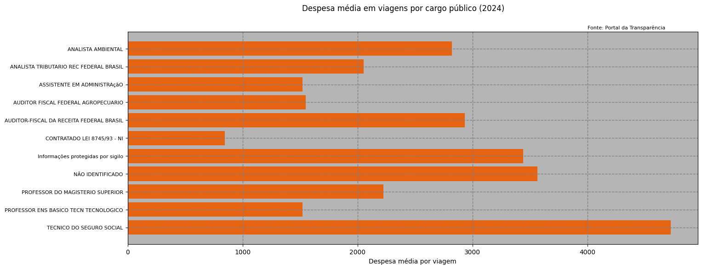

# 📈 Análise de Viagens a Serviço com dados do Portal da Transparência – 2024

Este projeto foi desenvolvido enquanto acompanhava o curso **"Python para Dados: do Zero à Análise Completa"** da [Asimov Academy](https://asimov.academy).  
O objetivo é aplicar conceitos de **análise de dados com Python**, utilizando a biblioteca **pandas** para explorar e visualizar informações sobre **viagens a serviço de servidores públicos em 2024**.

---

## 🧩 Contexto

Os dados utilizados foram obtidos no **Portal da Transparência**, e contêm informações sobre viagens realizadas por servidores públicos federais no ano de 2024.  
O projeto busca responder a perguntas como:

- 💰 Qual é a **despesa média** por cargo?
- 🗓️ Qual é a **duração média das viagens**?
- 📍 Quais são os **destinos mais frequentes**?
- 👥 Quais cargos realizaram **mais de 1% das viagens** no período?

---

## ⚙️ Etapas principais

1. **Leitura e limpeza dos dados**
   - Tratamento de valores nulos e conversão de colunas de data;
   - Criação de novas colunas como “Despesas” e “Duração da viagem”.

2. **Análise e consolidação**
   - Agrupamento dos dados por cargo;
   - Cálculo de médias, totais e destinos mais frequentes;
   - Filtro para manter apenas cargos relevantes.

3. **Geração de resultados**
   - Exportação de uma tabela consolidada (`.xlsx`);
   - Criação de um gráfico de barras horizontais mostrando a despesa média por cargo.

---

## 📊 Exemplo de saída

Gráfico gerado:



---

## 📁 Estrutura do projeto
```
Analise_De_Viagens_a_Servico/
├── Análise.ipynb
├── data/
│ └── README.md
├── output/
│ ├── tabela_2024.xlsx
│ └── figura_2024.png
└── README.md
```

---

## 🔗 Fonte dos dados

Os dados podem ser acessados diretamente no [Portal da Transparência](https://www.portaltransparencia.gov.br/), na seção **Viagens a Serviço – 2024**.

> 💡 O arquivo CSV utilizado possui cerca de 445 MB, portanto **não está incluído neste repositório**.  
> Para reproduzir a análise, baixe o arquivo original e salve-o na pasta `data/` com o nome adequado antes de executar o notebook.

---

## 💻 Tecnologias utilizadas

- **Python 3**
- **Pandas**
- **Matplotlib**
- Google Colab

---

## 🧠 Aprendizados

Durante o desenvolvimento, foram explorados:
- Manipulação e limpeza de dados com **pandas**;
- Criação de colunas derivadas e uso de `.groupby()` e `.agg()` para agregações;
- Geração de gráficos personalizados com **matplotlib**;
- Exportação de resultados em formatos Excel e imagem;
- Boas práticas de organização de projetos de dados no GitHub.

---

## ✍️ Autor

**Matheus Lança**  
Curso: *Python para Dados – Asimov Academy*  

---

## 🚀 Como executar o projeto

1. Clone o repositório:
   ```bash
   git clone https://github.com/matheuslanca/Analise_De_Viagens_a_Servico.git
   cd Analise_De_Viagens_a_Servico


